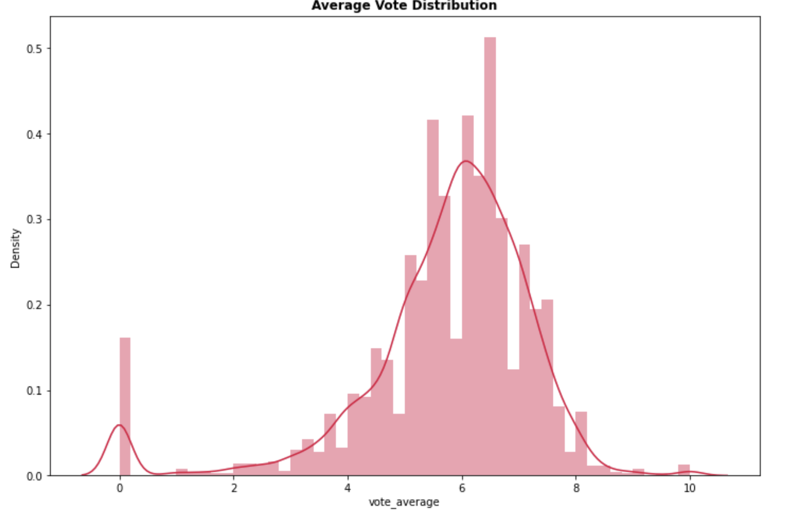
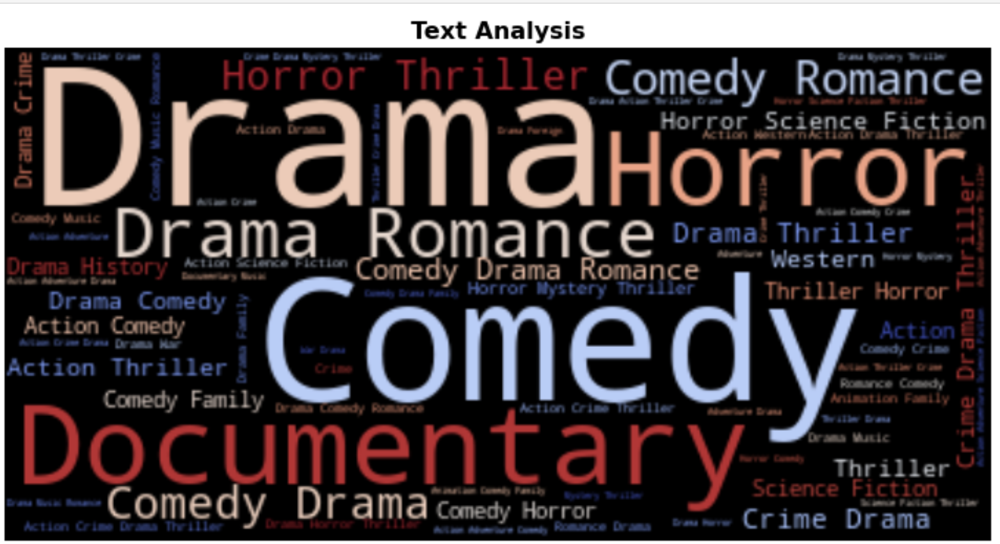
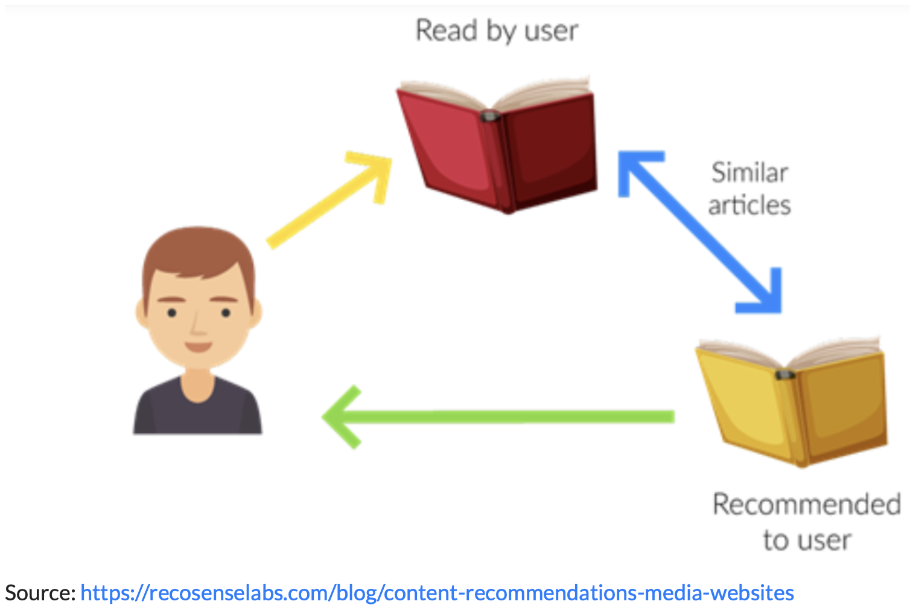
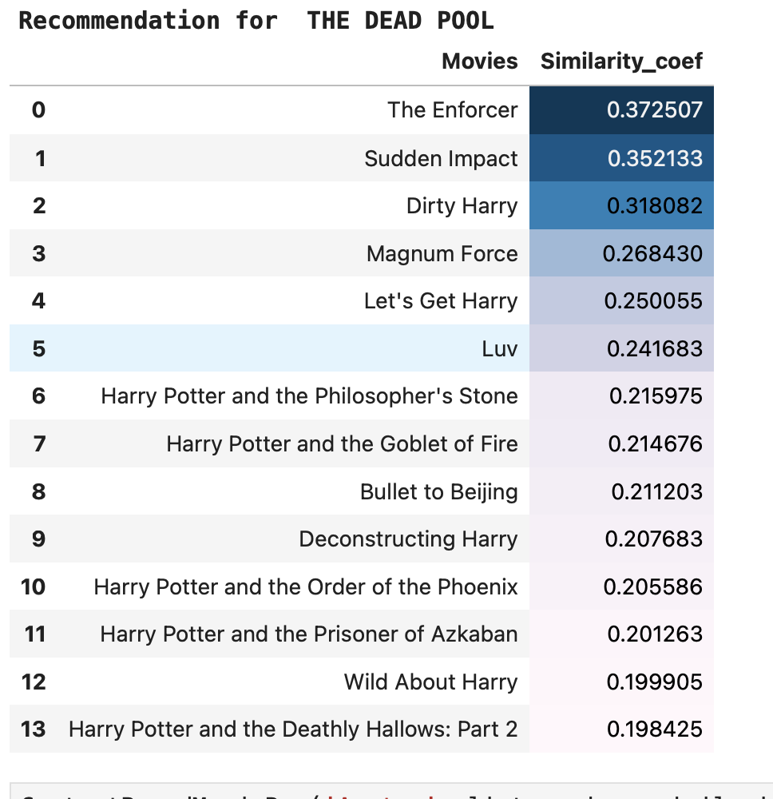
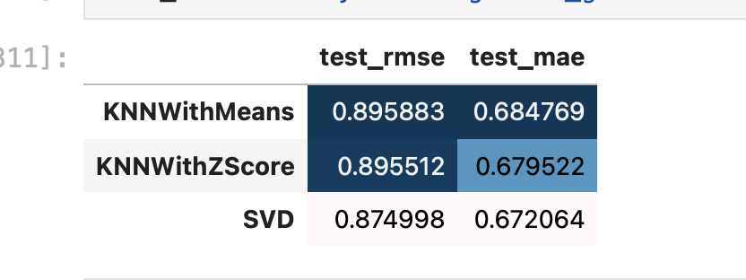
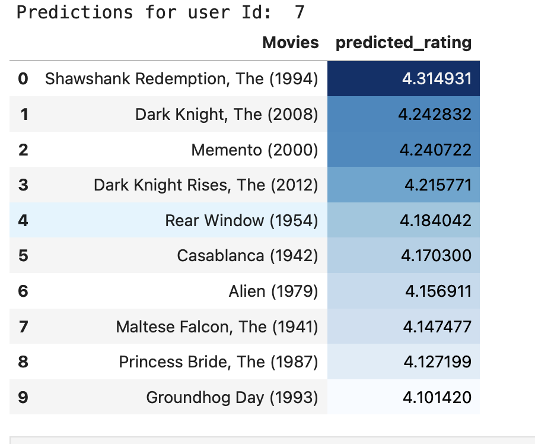

# Capstone Project: Movie Recommendation #
## Basazin Belhu ##
___
## Data Sources
1. [Movie_metadata](https://www.kaggle.com/ibtesama/getting-started-with-a-movie-recommendation-system/data?select=movies_metadata.csv)
1. [Movie_rating and User_id datasets](https://grouplens.org/datasets/movielens/)

#### Tables of Contents:
1. Introduction to Recommendation
2. Data Science Problem
3. Collecting & Identifying Data
4. Data Cleaning and Preprocessing
5. Exploratory Data Analysis
6. Recommendation Development
7. Recommendation Evaluation and Testing
8. Technology Used
9. Conclusions and Recommendations
10. Executive Summary
11. Future Works
# Introduction to Recommendation System

Recommendation Engine is very important for personalized adverts. It is the application of statistics, mathematics, information processing, and prediction theory models in the advertising market, It is a system that mathematical and statistical information filtering that seeks to predict the rating or the preference a user might give to an item  It saves energy, time, unwanted ads and increases the companies sales. 

With the widespread application of YouTube, Amazon, Netflix, and other digital e-commerce and entertainment in our daily activities, Recommendation Engine become widely applied in suggested products.  It is an algorithm that suggests products for the user based on their past activities. For example, Netflix and HULU  recommend movies or TV shows to watch, and for Spotify, they will suggest the song to listen to.

## Problem Statements
In the internet and cloud world  we have a lot of preference in the website/Netflix account/ to watch, but it is difficult to select the best one for ourselves before we watch the whole movie. This is the big problems for the customers. The data scienetist team has all customer's past information and want to create a best recommendation for the customer. I justed hired by the new entairtenment industry and they want to create an alogorithm that recommend different movies for customers and increase their satisfcation with our stratup services.  

## Collecting & Identifying Data

Data has been collelct from the above data sources.The data from the Kaggle is used to create the Content based recommendation. This data has many columns to describe the metadata of the movies and The main Movies Metadata file. Contains information on 45,000 movies featured in the Full MovieLens dataset. Features include posters, backdrops, budget, revenue, release dates, languages, production countries and companies etc. The data from the movielens website is for collaborative filtering recommendations. This datasets have the colums for the have two componenets rating and user. 

The primary data set into Python in order to preview the dataset's structure and make determinations about how to process the data in advance of modeling. Below is the data dictionary for our primary data set:
- ### Data dictionary 
| Column | Type   | Definition  |
| :---:   | :-: | :-: |
| adult' | bool |  Is the mvie for adult or no |
| budget | float |total buget for the movie until its production | 
| genres | dict |the different genres in that movie| 
| id | str |movie id |
| imdb_id | str |Internet Movie Database id |
| original_language | str |the original language the movie was made spoken in the movie | 
| original_title |str |the original title of the movie |
| overview |str |the summary about the movie |
| popularity |float |how the movie is a popular | 
| production_companies |str |the movie production company name |
| production_countries |str | the country where the movie made|
| revenue | float |the total money made from the movie | 
| runtime  | float |how long the movie finish or take to watch |
|spoken_languages | str |languages spoken in the movie |
|status | str |The production stage the movie | 
|tagline | str |the short text for tagging a movie |
|title | str | the title of the movie commonly known by|
|video | bool |does the movie has video or no | 
|vote_average | float |the average count of voters for that movie |
|vote_count  | float | the count of voters for that movie|

## Exploratory Data Analysis
Different Techniques has applied to clean the messy movie metadata. The different data visualization and statstical manipulation done before start modeling and evaluations.
The The average vote is the user rating about that movie from 0 to 10. 

- Some Text analysis about the movie genres.

# Recommendation Development
- ## Content Based Filtering Recommendation
- Content Based Filtering Recommendation suggest products that has similar descriptions or overviews.

- ## Collaborative Recommendation
- Collaborative Filtering suggest items based user activities and commonality preference with other users
- ## Recommendation Evaluation and Testing
- ### Content Based Filtering: 
- similarity score between the items or movies
- ### Model Testing

- ### Collaborative Filtering 
- Recommend based customer interaction with producst and common interest with other users
- ### Metrics: RMSE and MAE

- ### Model Testing

# Technology Used
- Python
- Jupyter lab
- Pandas, Numpy, surprise, matplotlib, seaborn, 
- GitHub

# Conclusions and Recommendations
I executed how to build both the content and collaborative filtering movie recommender system with python. I have provided the model with an understanding of the cosine similarity and pairwise for content-based filtering, and  Matrix Factorization, and K Nearest neighborhood for collaborative filtering methods. I have introduced the main data flow for model development and provided implementations of content-based, filtering, and user and item-based collaborative filtering algorithms on it.

# Executive Summary
On the internet and cloud world, we have a lot of preferences on the website/Netflix account/ to watch, but it is challenging to select the best one for ourselves before we watch the whole movie. This is a big problem for the customers. The data scie¬ntist team has all customers' past information and wants to create the best recommendation for the customers. The new entertainment industry has just hired me. They want to create an algorithm that recommends different movies for customers and increases their satisfaction with our startup services.
The goal of this project is to create the optimal movie recommendation system based on customer past data. The data were collected from Kaggle and MovieLens. I applied feature engineering to remove some unnecessary data from some text columns followed by EDA. One of the main challenges in developing movie recommendations is finding the appropriate metrics for the model. Still, I will be using the cosine similarity score for the content-based recommendation engine and RMSE and MAE for the user-based collaborative filtering engine. 

After developing the recommendation engine based on the content and collaborative techniques, I have found that every column is very important for some discoveries. Cleaning and feature engineering steps are the key in modeling developments. I discovered that we could process both the text and numerical values for the recommendation engine. 
I assumed that the text features were unique. Still, when I combine the different text features, there may be some word repetition, which could be risky because the TF-IDF considers the opposite when determining the importance of a word for the movie description.  This may affect the similarity score and the result generated in the testing. 

After all the above assumption and metrics implementation, I have created a movie recommendation engine. This engine tested on different movies and users and it generate different movie recommendations. 

# Future Works
Prepared a better computing computer to run a larger datasets and apply gridseach on some models.
Train the algorithm on the bigger datasets and add more features to make a more effective and personalized engine. Then add Deep Learning alorithms to create a more advance model. 