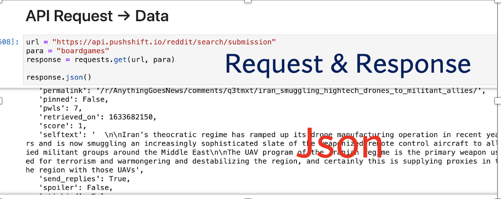
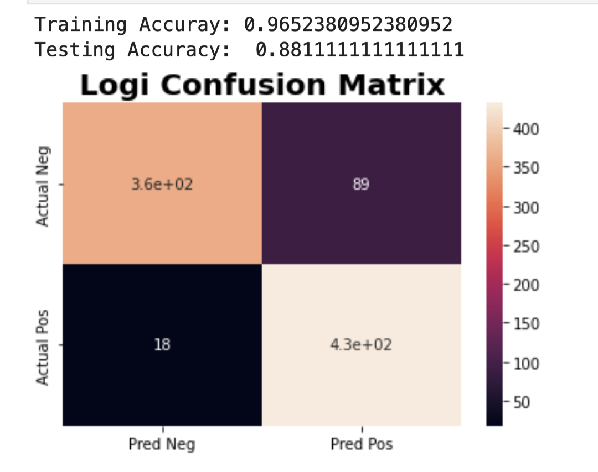
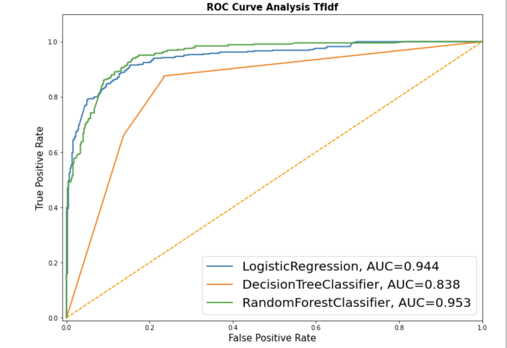

# **GA DSI:** Project Three:

- ## Web API's and Natural Language Processing 
    - ### Name Basazin Belhu
    - ### Oct. 08, 2021

# Executive Summary:

**Problem Statement:**

**Can you create an algorithm that classify the different reviews to targeted products for the R&D team?**

Numpy is a StartUp gaming technology. This company wants to increase our customers' satisfaction for the upcoming game technology.  The a R&D team wants to know different reviews of our recently launched video and board games. Numpy wants to know which review belongs to the video game or board game with higher accuracy and efficacy as well as want to know which features of the new product customers liked and hated.

The objective is to come up with the right classification algorithm that we can use as a customer reviews about our recent product. Allowing the  R&D  to get feedback about the recent product and suggesting what needs to change and what they like about it, before launching our next product  will hopefully  increase our customer experience .

**Propose the Solution:**
This problem can be tackled using a supervised learning calssification approaches. Since it's a classification problem, and we have to reduce both the false positive and false negative rates , the evaluation metric hould be the accuracy.  To get a more accurate understanding and classification  for this problem, a potential dataset that we can collect would be more about the users experience about our previous prodcuts. g. In order to accomplish this we will do the following tasks:
- Train different classification models and select based on their performance
- Analyze and classify  our product reviews and tweets from the customers
- We will trained the model with data from diverese platforms and automated the algorithms to classify the reviews from different social media platforms

**Value:**
With new automated reviews classifier algorithms we are expected to become one of the top three best gaming industries. Solving our customers' complaints  will increase our customers satisfaction and make them a life long client which could increase our annual net profit by upto 10%.

**Final Thoughts:** 
This will save a lot of time for  the R&D team during designing and producing the new product of the NumPy. Collecting the customer reviews will help the research and development team to design a world class gaming technology-- it will also increase the value of our brand in positive ways.  

# Methods Used
- Data Collected from Reddit website
- ### API's

- CLeaning the dirty data with 
- Natural Langauge Procssing Steps
- Apply the calssification Models.
- Evaluate the Models

### Exploratory Visualizations and Feature Engineering
- CountVectprized
- TF-idf
- Check most common words
- Train test split

### Modeling and Metrics
- Baseline, Logistic regression, Randomforest,DecisionTrees 
- ## Accuracy

- ## ROC-AUC

# Technologies
- Python3
- GitHub
- Reddit
- Pandas,Numpy, Matplotlib, Seaborn, request, nltk jupyter lab, Scikit-learn

# Data
The data for this model very complaex as it has many columns. The raw data collect from the reddit website was a messy json file. Then the value related to the **data** key of  messy json coverted to the dataframe. There were over 84 columns, we only interested in the subreddite, selftext and title columns. The data of was split into a testing and training dataset during the model trainig.

## Data dictionary 
| Column | Type   | Definition  |
| :---:   | :-: | :-: |
| subreddit | str |  the params or the key for the urld |
| selftext | str |the comment they person wrote about the title | 
| title | str |the title of the person posted on the reddit | 
| text | str |the title and the selftext conbined |
|count| int | the length of text|

## Challenges

Collecting the data from the reddit was challenging. I did not know how I can manipulate the different params to scrape the website, but asked help during class.
The other challeges I had was combined all the analysis and visualization to make concise summary

# Conclusion and Recommendation

The research and crtical analysis done as required, based one problem definition to implementation algorithm development, execution and analysis the developed alogarithm.
We have tried the three classification mdoeland the DecisionTrees model performd the worst. The Randome forest and logistic regression have similary accuracy on the testing but different on training datasets. 
The Logistic regression model for classify the reveiws based on different vectorization and TF-iDF values. This alogrithm has an accuracy of 0.94 on the training and 0.88 on testing daat.

**Recomendation**: In the future, we will collect more data from a diverse platforms such as yelp and google to improve th accuracy of logistics Regression. Deploy the model to the productioon after it pass all the quality control of NumPy.